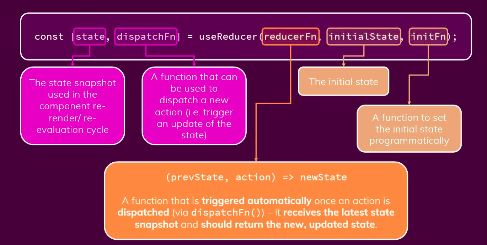

# useReducer

Reducers became "famous" (at least for me) with the `Redux` library because help you to manage big chucks of states of your app.

The `useReducer(reducer, initialState)` hook accept 2 arguments: the reducer function and the initial state. The hook then returns an array of 2 items: the current state and the dispatch function.

`useReducer` is usually preferable to useState when you have complex state logic that involves multiple sub-values or when the next state depends on the previous one. useReducer also lets you optimize performance for components that trigger deep updates because you can pass dispatch down instead of callbacks.

```js
const [state, dispatch] = useReducer(reducerFn, initialValue)
```



---

## How useReducer Hook work?

The dispatch function is a special function that dispatches an action object (type and payload).

The reducer is a pure function that accepts 2 parameters: the current state and an action object. Depending on the action object, the reducer function must update the state in an immutable manner, and return the new state.

Most of the time we work well with state handled by `useState` but this is forcing us to keep it inside our component and make it difficult to pass these data to a different component that could use the values stored inside.


---

## useState vs. useReducer

`useState` and `useReducer` are the two native ways of managing state in React.

```js
const [state, setState] = useState(initialValue);

const [state, dispatch] = useReducer(reducer, initialVal
```

`useState` is a basic Hook for managing simple state transformation.

`useReducer` is an additional Hook for managing more complex state logic. However, it’s worth noting that useState uses useReducer internally, implying that you could use useReducer for everything you can do with useState.

With `useReducer`, you can avoid passing down callbacks through different levels of your component. Instead, `useReducer` allows you to pass a provided dispatch function, which in turn will improve performance for components that trigger deep updates.

`useState` is a great way to define a state, but it does have its limnotions. The setter functions can grow too big if the logic gets complicated, plus you haves make sure that you return new items in every setter function using  the spreading syntax. Also, if one state depends on another, you can end up writing tedious logic to make sure everything is correct in all of your dependencies.

When dealing with complex interactions, we need to define multiple pieces of states and managing logic can get out of control. We can prevent this state logic from gorwing too out of control through the use useReducer.

It also shines when you update multiple parts of your state from different "actions", e.g. when implementing a multi-step wizard. You might want to initialize the second step depending on data chosen in the first step, or you might want to discard data of the third step when going back to the second.

All these dependencies between parts of your state would need you to call setState multiple times in a row when you have independent useStates (one for each step), and it would also get quite messy if you'd had a single state object.

---

## Where to use useReducer over useState?

- **Having complex state**. When you have complex state logic that involves multiple sub-values. `useReducer` provides more predictable state transitions than useState, which becomes more important when state changes become so complex that you want to have one place to manage state, like the render function.

- **When next state depends on the previous**. `useReducer` gives more predictable state transition.

---

## What are the advantages of using useReducer?

- **Improve performance**. useReducer also lets you  improve performance for components that trigger deep updates because you can pass down a dispatch instead of callbacks.

> **_NOTE:_**  React guarantees that dispatch function identity is stable and won’t change on “re-renders”. This is why it’s safe to omit from the useEffect or useCallback hook dependency list.

- **Easy to test**. `useReducer` allows us to define a reducer function in advance and keep all your application logic inside the reducer instead of spread around various parts of the UI. This will not only make it easier to reason about state transitions, it will also make your logic super easy to test (really, pure functions are the easiest to test).

